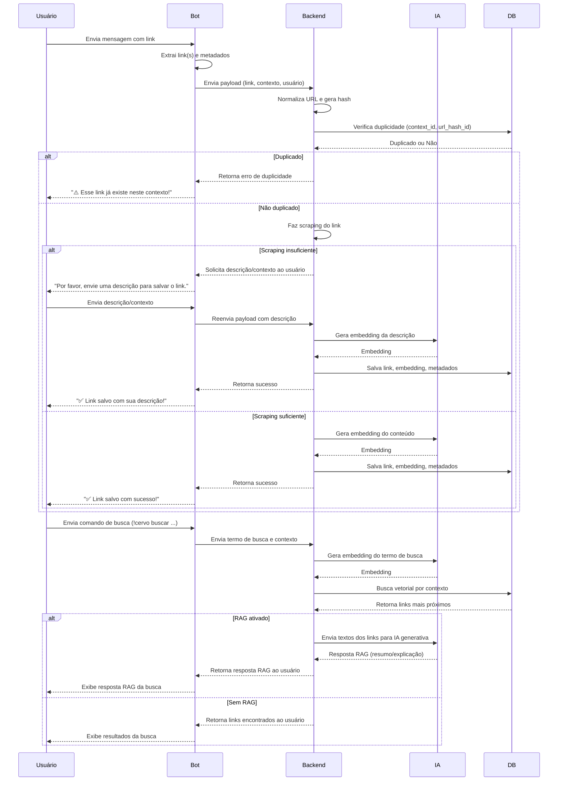

```mermaid
sequenceDiagram
    participant Usuário
    participant Bot
    participant Backend
    participant IA
    participant DB

    %% Upload de link
    Usuário->>Bot: Envia mensagem com link
    Bot->>Bot: Extrai link(s) e metadados
    Bot->>Backend: Envia payload (link, contexto, usuário)
    Backend->>Backend: Normaliza URL e gera hash
    Backend->>DB: Verifica duplicidade (context_id, url_hash_id)
    DB-->>Backend: Duplicado ou Não

    alt Duplicado
        Backend-->>Bot: Retorna erro de duplicidade
        Bot-->>Usuário: "⚠️ Esse link já existe neste contexto!"
    else Não duplicado
        Backend->>Backend: Faz scraping do link
        alt Scraping insuficiente
            Backend-->>Bot: Solicita descrição/contexto ao usuário
            Bot-->>Usuário: "Por favor, envie uma descrição para salvar o link."
            Usuário->>Bot: Envia descrição/contexto
            Bot->>Backend: Reenvia payload com descrição
            Backend->>IA: Gera embedding da descrição
            IA-->>Backend: Embedding
            Backend->>DB: Salva link, embedding, metadados
            Backend-->>Bot: Retorna sucesso
            Bot-->>Usuário: "✅ Link salvo com sua descrição!"
        else Scraping suficiente
            Backend->>IA: Gera embedding do conteúdo
            IA-->>Backend: Embedding
            Backend->>DB: Salva link, embedding, metadados
            Backend-->>Bot: Retorna sucesso
            Bot-->>Usuário: "✅ Link salvo com sucesso!"
        end
    end

    %% Busca de links
    Usuário->>Bot: Envia comando de busca (!cervo buscar ...)
    Bot->>Backend: Envia termo de busca e contexto
    Backend->>IA: Gera embedding do termo de busca
    IA-->>Backend: Embedding
    Backend->>DB: Busca vetorial por contexto
    DB-->>Backend: Retorna links mais próximos
    alt RAG ativado
        Backend->>IA: Envia textos dos links para IA generativa
        IA-->>Backend: Resposta RAG (resumo/explicação)
        Backend-->>Bot: Retorna resposta RAG ao usuário
        Bot-->>Usuário: Exibe resposta RAG da busca
    else Sem RAG
        Backend-->>Bot: Retorna links encontrados ao usuário
        Bot-->>Usuário: Exibe resultados da busca
    end
```